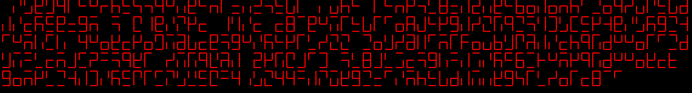

# Cyberscript
A short python script that encodes textual input via a custom cypher and displays the result in a a pseudo 7 segment display format. The cypher itself is hardly secure but is designed to be human readable after some training. 

Everything required to encode your own messages is included in Cyberscript.exe, simply type a message into the consol and hit enter.

### An example output

